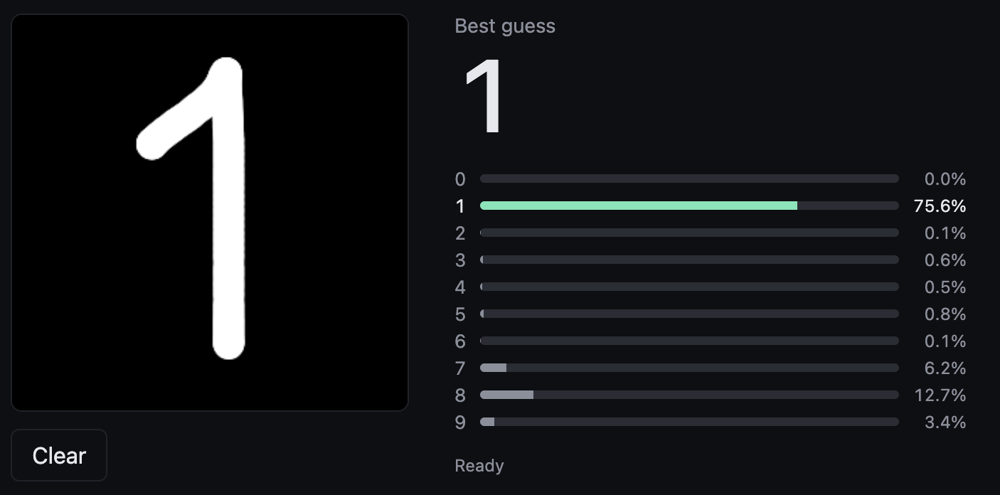
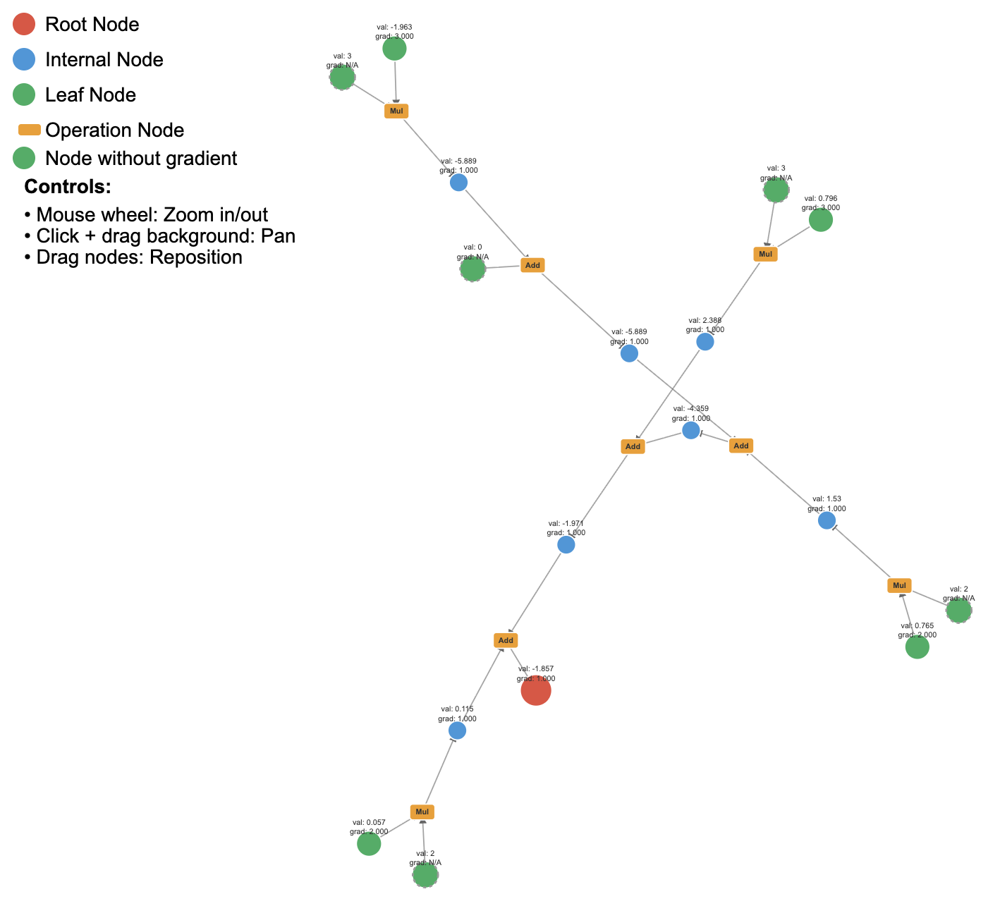

# nanograd

Minimal automatic-differentiation engine written in Rust.

Everything is built from scratch, the only dependencies are `image` (for decoding PNGs) and `rand`.

## Quick start

Pick an example to run:

```bash
cargo run --release -- xor          # train an MLP on XOR, dump a perceptron graph
cargo run --release -- mnist serve  # serve the trained MNIST web demo (default: mnist.ng)
cargo run --release -- mnist train  # train the MNIST CNN and save it (default: mnist.ng)
```

The `xor` example trains a tiny Multi-Layer Perceptron to learn the XOR function and writes a rendered computation graph of a single Perceptron to `perceptron_graph.html`.

The `mnist` example trains a small convolutional network built from the scalar autodiff engine to recognise handwritten digits, then serves a browser demo on `0.0.0.0:8200` where you draw a digit and watch the live class probabilities.



## Usage

```rust
use nanograd::scalar::{Scalar, func};

let x = Scalar::new_grad(2.0);
let y = Scalar::new_grad(-1.0);

// z = relu(x * y + 3)
let z = func::relu(x.clone() * y.clone() + 3.0);
z.backward();

println!("z = {}", z.get_value());
println!("dz/dx = {:?}", x.get_grad());
println!("dz/dy = {:?}", y.get_grad());
```

## How it works

- Each `Scalar` stores **value**, optional **gradient**, and an `Edge` describing the operation that produced it.
- Operator overloads (`+`, `*`, `-`, ...) and helpers in `scalar::func` build a directed acyclic graph of `Scalar`s while caching the **local derivative** for every edge.
- `backward()` starts at an output node and **recursively propagates gradients** along the graph, accumulating them into the leaf nodes created with `Scalar::new_grad`.
- The graph can be visualised with `plot::dump_graph`, which emits a self-contained D3.js HTML file.

The image below is one such interactive graph emitted by `dump_graph` for the forward pass of a 2D convolution filter:


